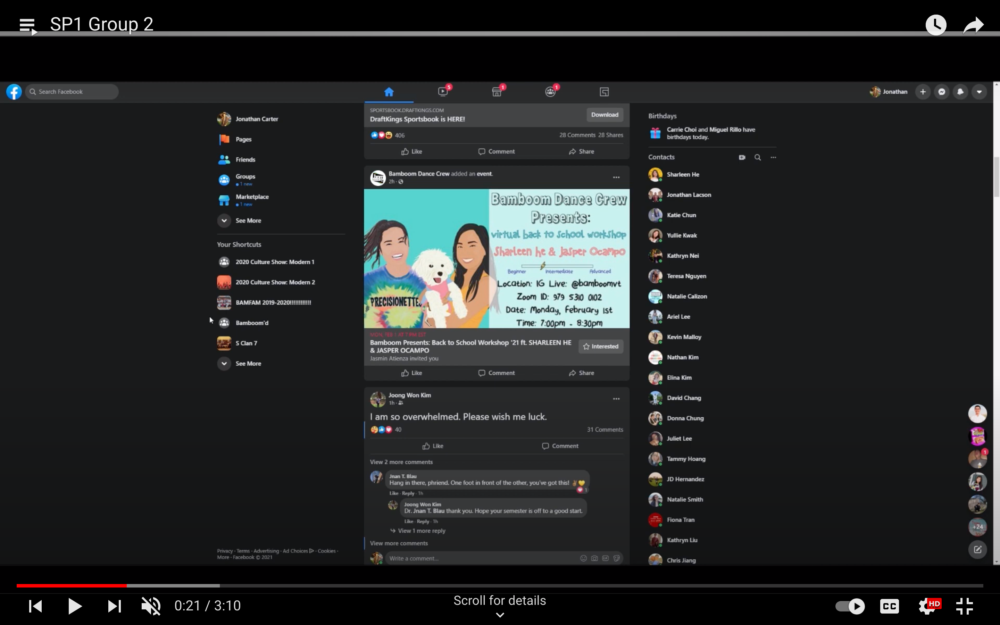
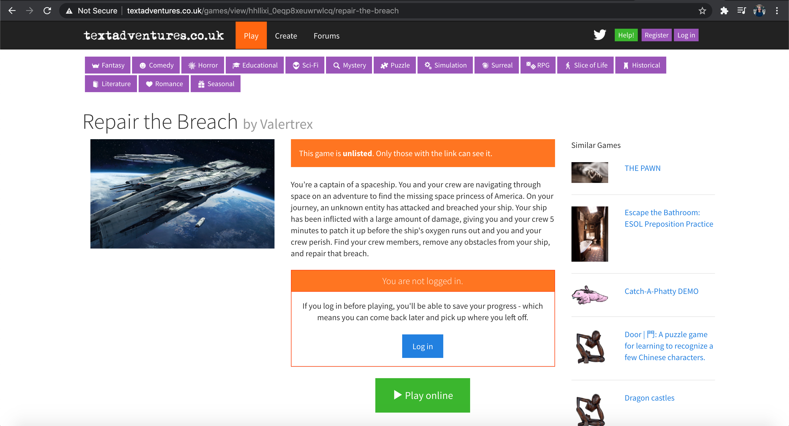
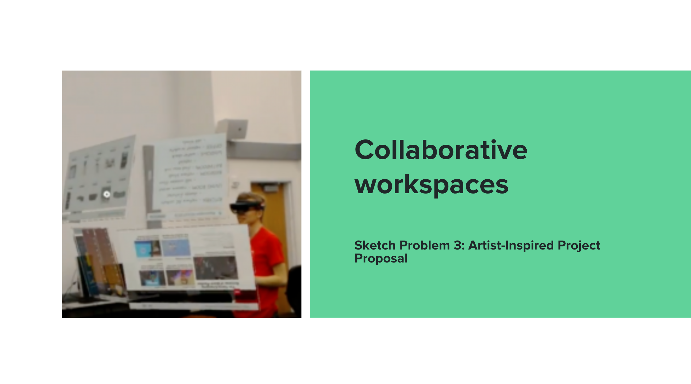
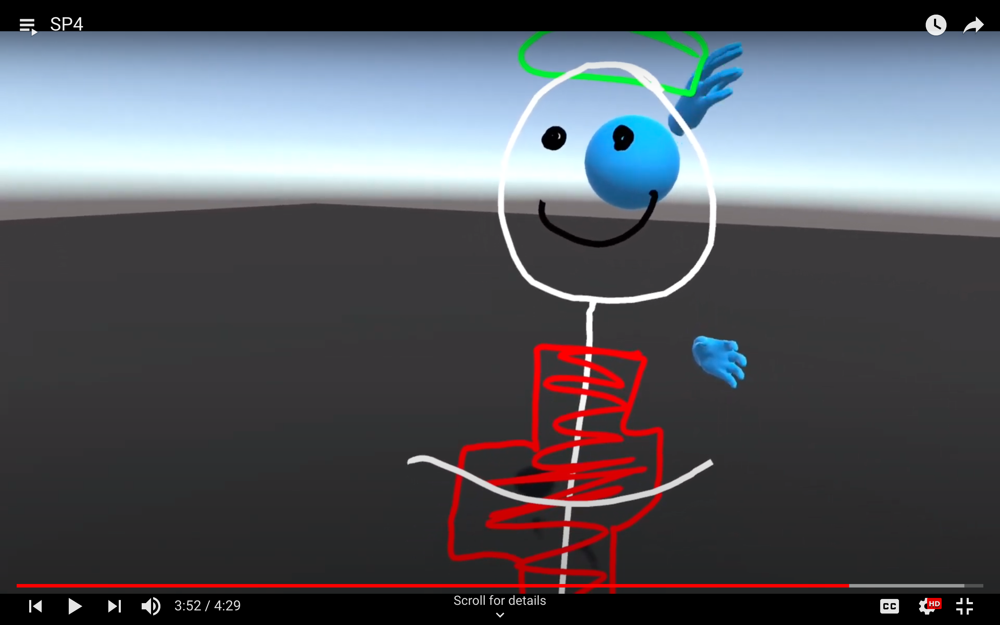
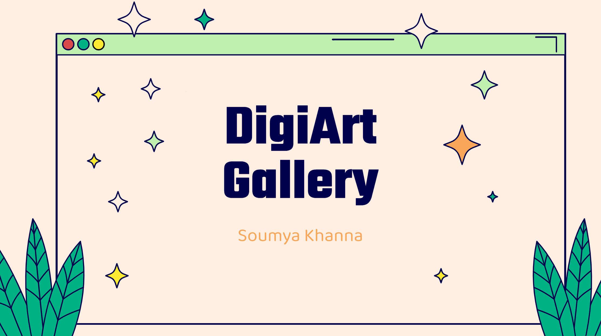
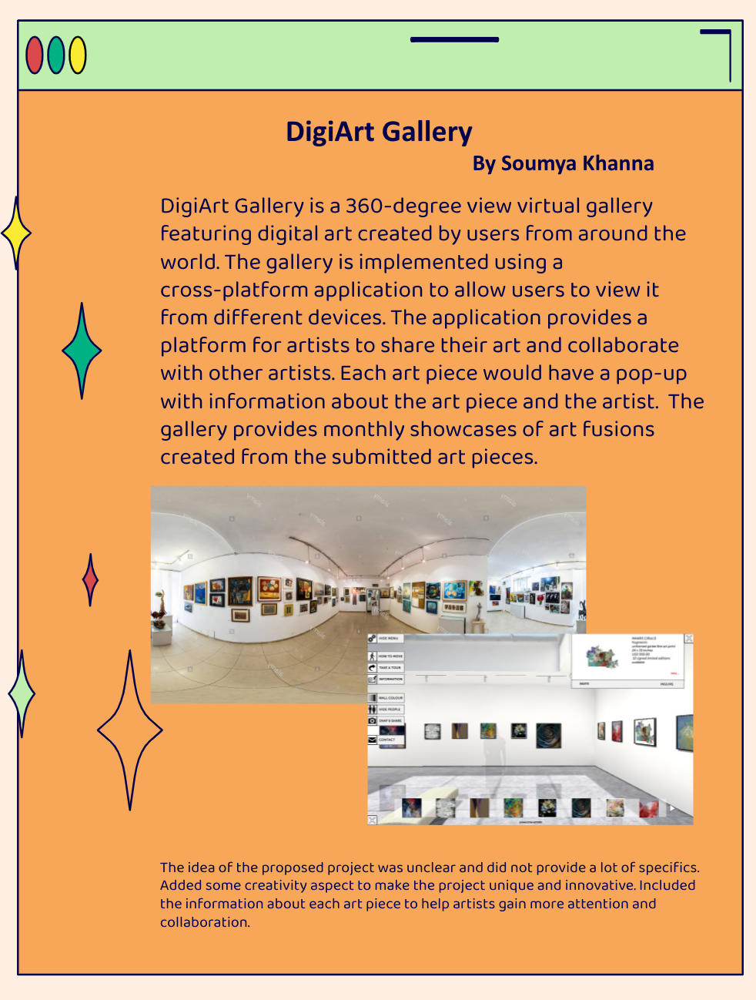
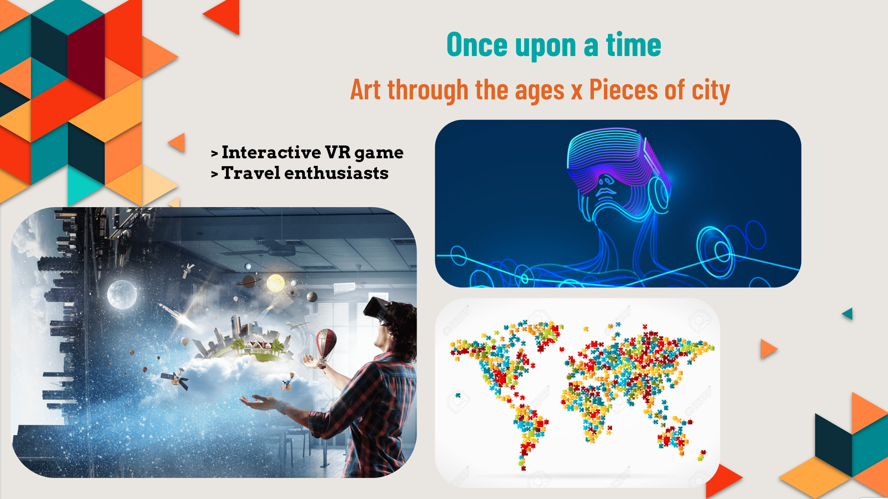
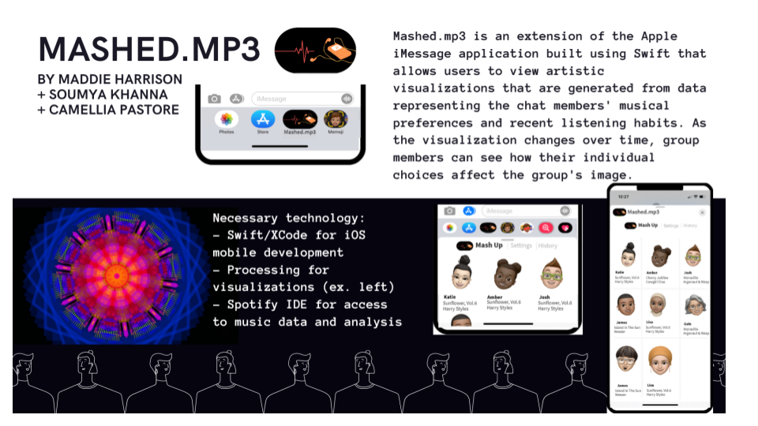
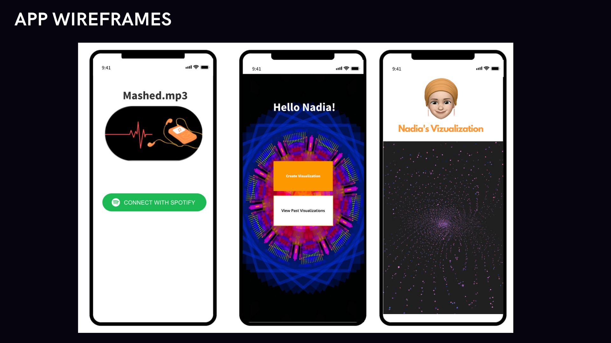

## Human Computer Interaction

## Creative Computing Studio
**Theme: Together x Apart x Time x Space**

### Sketch Problem 1: Introductions

**Our Approach:** We decided to introduce ourselves through the eyes of a third-person viewing our Facebook profiles.

**My Contribution:** Social media is a big part of my life, and I use it to express myslelf. While brainstroming ideas, it was natural for me to think of social media and pictures to introduce our team. We decided to have a clear structure about the information we'd share such as hobbies.

**Relevant links:** [Video](https://www.youtube.com/watch?v=tDKGgi064t4&list=PLzVUVeWLd5PfjRIkDI2gIjZRLs7Q-CYBA&index=6)

### Sketch Problem 2: Narrative

**Our Approach:** Created a text-adventure space themed game with tasks for users to compelete which decide their destiny  

**My Contribution:** Worked on developing the game with its multiple conditions and results  

**Relevant links:** [Game](http://textadventures.co.uk/games/view/hhllixi_0eqp8xeuwrwlcq/repair-the-breach)

### Sketch Problem 3: Artist-Inspired Project

**My Contribution:** I have always admired collaboration in virtual environments which led me to choose this project

**Relevant links:** [Presentation](https://docs.google.com/presentation/d/1YMuPMyhkrBzps4o0gJKbQU2gl-089PVQFtmCEG8DZVY/edit?usp=sharing)

### Sketch Problem 4: Synthesia Space

**Our Approach:** Created a Virtual Reality multiplayer game where the colors and the positioning of the sketch created different sounds

**My Contribution:** Worked on the multiplayer aspect of the VR game

Relevant links: [Demo](https://www.youtube.com/watch?v=9E0mPhA-Su0&list=PLzVUVeWLd5PfjRIkDI2gIjZRLs7Q-CYBA&index=3)

### Project Proposal: Pechakucha

**My Contribution:** Proposed a Digital Art gallery to showcase digital art in a 360-degree environment

**Relevant links:** [Presentation](https://docs.google.com/presentation/d/1ZxBrmozrfvM9ea9LuelxlLjZVNZYiJ82W4XfdmbwBt8/edit?usp=sharing)

### Project Proposal

**Relevant links:** [Presentation](https://docs.google.com/presentation/d/1Yj1qQZfvry8xHatVKkl31AVZJwPnGGDV52ZvYedLEVk/edit?usp=sharing)

### Project Proposals Mashup

**Relevant links:** [Presentation](https://docs.google.com/presentation/d/1mHMU_tXg_odgcnpEnPWeRbirNBNuxTJeKe3LLi4TCMI/edit?usp=sharing)

### Semester Project

**Our Approach:** Developed an iOS application to create beautiful visualizations based on a group's music preferences via Spotify.

### Poster

### Wireframe

**My Contribution:** Worked on iOS development and Spotify APIs

**Relevant links:** [GitHub](https://github.com/soumyakhanna/Mashed.mp3)

## Thrifty
### SummerHacks 2020 hosted by FreeTailHackers
 **Project Description:** Thrifty allows you to manage user expenses, capture photos of receipts, divide the expenses into categories, and display local businesses that provide cheaper options and help support them during the pandemic.
 **Technologies:** Python, ReactNative, numpy

**Relevant links:**
[Demo](https://youtu.be/8VDqAQhb80g) | [Devpost](https://devpost.com/software/thrifty-69fay0) | [GitHub](https://github.com/soumyakhanna/Thrifty)

## RunTime
### SheHacksVT 2020 hosted by Association of Women in Computing (AWC)
 **Project Description:** A web app aimed for runners that lose motivation
 **Technologies:** HTML, CSS, JS, jQuery
 **Award:** Won Best Cyber-Focused Award

**Relevant links:**
[GitHub](https://github.com/soumyakhanna/runTime)

## ParkMyCar
### VTHacks 7
 **Project Description:** It optimizes parking lot challenges faced by JB Hunt company representatives faced on a daily basis. It provides shuttle service to nearby parking lots to manage a large number of parking requests.
 **Technologies:** HTML, CSS, JS, jQuery

**Relevant links:** 
[Devpost](https://devpost.com/software/parkmycar-15lazr) | [GitHub](https://github.com/soumyakhanna/parkMyCar)
